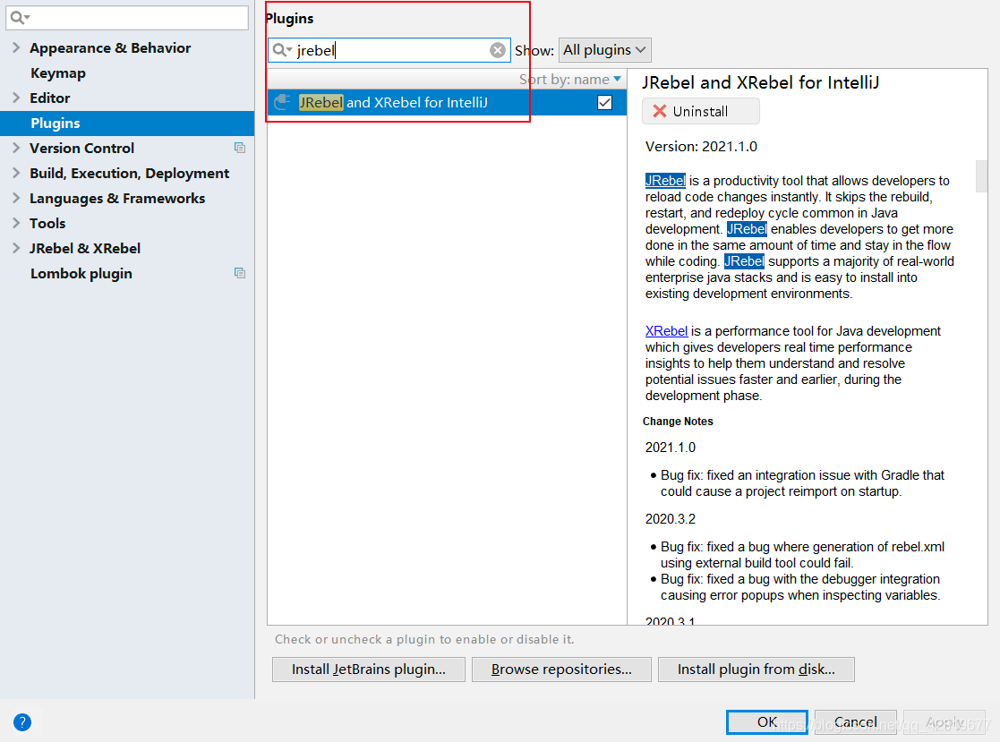
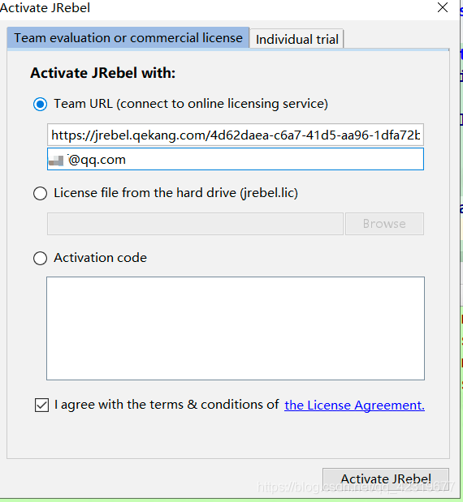
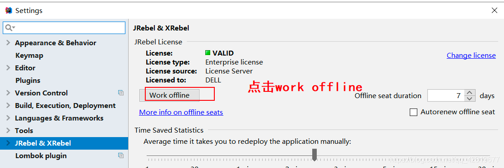

# 第一节：IDEA实现热部署

作者：伊邪那岐
 博客：[http://blog.xiangll.cn](http://blog.xiangll.cn)
 原文：[http://blog.xiangll.cn](http://blog.xiangll.cn)

> 随手记录，防止遗忘📝，并非教程。

## Jrebel

> Jrebel 可快速实现热部署，节省了大量重启时间，提高了个人开发效率。
> JRebel是一款JAVA虚拟机插件，它使得JAVA程序员能在不进行重部署的情况下，即时看到代码的改变对一个应用程序带来的影响。

## 安装

1. 打开IDEA在**设置**中找到`Plugins`搜索`jrebel`

   

2. 安装完成后激活,下面是生成GUID的几个地址

	> 1. **[https://www.guidgen.com](https://www.guidgen.com/)**
	>
	> 2. **http://www.ofmonkey.com/transfer/guid**
	>
	> 3. **https://www.guidgenerator.com/online-guid-generator.aspx**

  获取到GUID后复制下来.替换{GUID}
  Service Address ：https://jrebel.qekang.com/{GUID}

3. 开始激活(邮箱随意填写)

   

## 注意

  **注意:jrebel激活之后默认是联网使用的 , 在该模式下 , jrebel会一直联网监测激活信息 . 所以要改为离线使用**

   

   

   
