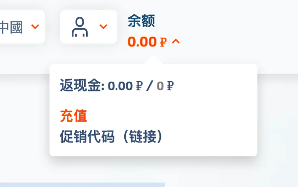
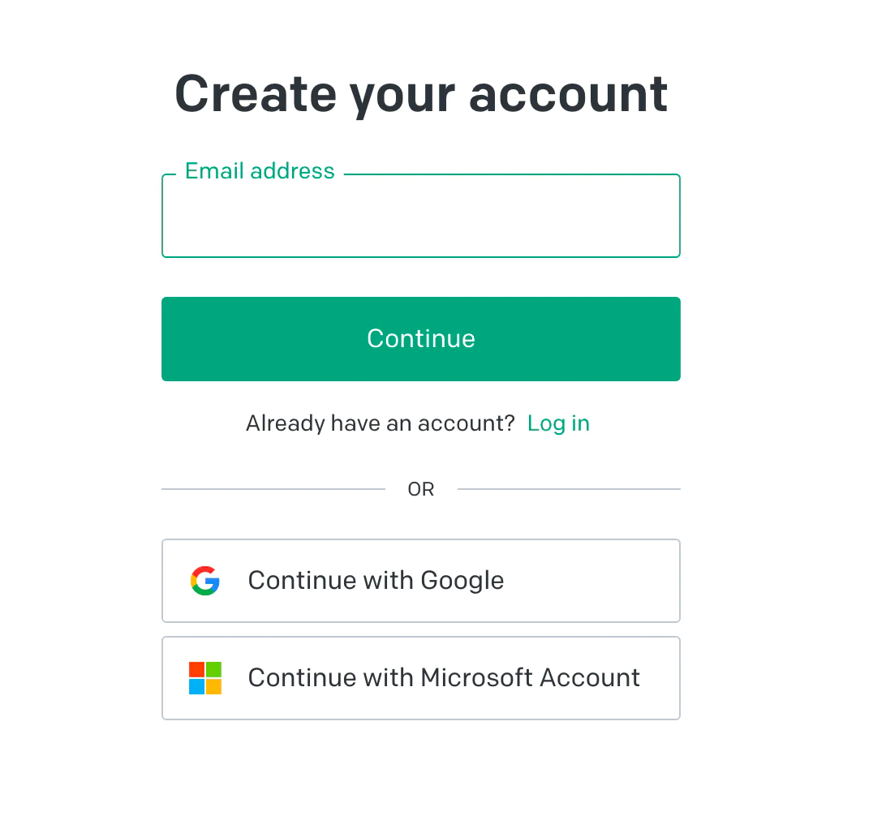
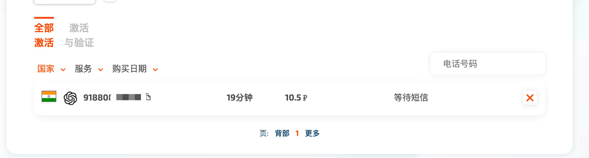

# 注册Chat-GPT全攻略

作者：伊邪那岐
<br/>博客：[http://blog.xiangll.cn](http://blog.xiangll.cn)
<br/>原文：[http://blog.xiangll.cn](http://blog.xiangll.cn)

> 随手记录，防止遗忘📝，并非教程。

### 准备
1. 代理要求是,韩国、日本、印度、新加坡。美国这几个地址,其他的不太清楚,反正香港肯定不行。

2. 准备一个国外手机号,如果没有用接码平台也行,有些接码平台是无法接的,所以我找了一个[https://sms-activate.org](https://sms-activate.org/)

3. 准备一个浏览器

### 第一步 准备接码
> 准备接码 打开接码平台 [https://sms-activate.org](https://sms-activate.org/) 注册一个账号



> 这里的单位是卢布
> 
> 接码OpenAi的一次费用是大概11卢布,人民币来看差不多是1块钱,不过只能充美金,就先充个1美金吧。
> 

> 充值完成需要等一会，就先放着，直接进行下一步。

### 第二步 注册OpenAI账号
> 首先是打开ChatGPT的账户注册页面。谷歌注册或者邮箱注册都可以,无所谓. 这里用邮箱注册作为例子。



> 用邮箱注册后有个验证邮件，进去邮箱，点开链接。


> 现在开始一步步走就行了。
> 
> 当然!有一些人会在这里遇到一个问题,会出现提示说不能在当前国家服务.


**不用怕! 我写这文章就是为了解决这个问题**

**来, 给你一招! 一般你出现这种问题, 就是因为你的代理没有全局, 或者位置不对。香港的代理是100%无法通过的。**

**但是又有个非常神奇的问题, 只要你出现了这个提示, 那么你接下来怎么切换代理, 都是没用的! 现在教你一招解决。**

#### 解决地区问题 - 方法一

> 首先，你要把你的代理切换到不是香港的地区，我这里选韩国。
> 
> 然后，先复制下面这段代码
> 
> ```window.localStorage.removeItem(Object.keys(window.localStorage).find(i=>i.startsWith('@@auth0spajs')))```
> 
> **接着在地址栏里输入** ```javascript:```
>
> **注意，这里一定要输入，因为你复制的话是粘贴不了的。**
> 
> 然后再粘贴我们第一段复制的内容
> 
> 
> 然后按下回车键，接着刷新页面，如果你的代理没问题，**就可以正常看到注册页面了。**

#### 解决地区问题 - 方法二

> 开启无痕模式/隐身模式，重新尝试即可，记得在尝试前，可以打开ipip.net查看一下自己ip，如果还是国内，请检测代理问题。

### 第三步 填写手机号


> 这里我们选择印度，然后到我们的接码网站上去。在左侧搜索OpenAi，然后点击印度。


> 点击小黄车。

 

> 然后我们复制这个号码，粘贴过去。然后我们点击发送验证码就完事了。
> 
> 等一会网站会提示验证码，我们复制粘贴。

 

> **这样就成功了，随便点一个进去完事。**

### 第四步 使用ChatGPT

注册完后，我们去[ChatGPT网站去登陆](https://chat.openai.com/auth/login)。


**在下面这个地方就可以开始你的奇思妙想了!**

### 常见问题

#### 访问被拒绝


解答：
1. 切换代理，刷新页面。(本人常用台湾地区的代理就可以，使用别的地区就会出现这样的情况。)
2. 切换代理后注意浏览器缓存问题，**关闭所有无痕窗口在重新开一个无痕窗口去访问即可**


